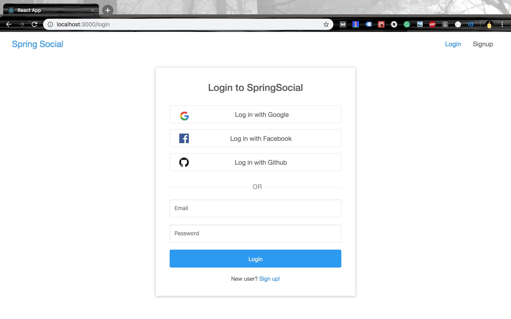

# Spring Boot React OAuth2 Social Login Demo
# Refer Github https://github.com/callicoder/spring-boot-react-oauth2-social-login-demo



## Setting up the Backend Server (spring-social)

+ **Create SQL database**

+ **Configure database username and password**

	```yml
	# spring-social/src/main/resources/application.yml
	spring:
	    datasource:
	        url: jdbc:sqlserver://localhost;databaseName=oauth2-restapi;encrypt=true;trustServerCertificate=true
			username: <YOUR_DB_USER>
	        password: <YOUR_DB_PASSWORD>
	```

+ **Specify OAuth2 Provider ClientId's and ClientSecrets**

+ **Run spring-social**

	```bash
	mvn spring-boot:run
	```

## Setting up the Frontend Server (react-social)

```bash
cd react-social
npm install && npm start
```